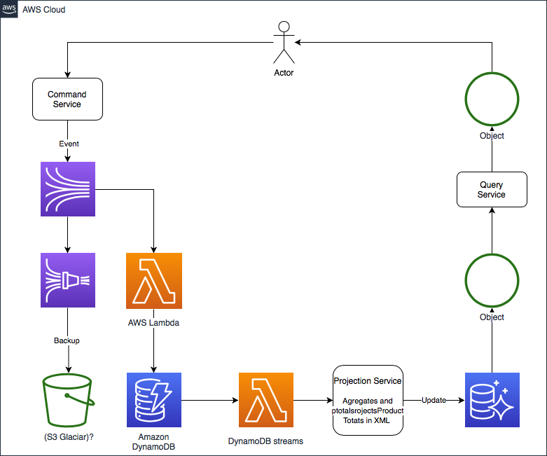

# Assignment
## What?
Spring Cloud Function to return a JSON representation of an ApaResponse.

## Dependencies
- Spring Cloud Functions
- Spring JDBC

## Execute
```
mvn spring-boot:run
```
Later call the function via:
```
curl localhost:8080/apaFunction -H "Content-Type: text/plain" -d "<some_id>"
```

## Test
```
mvn clean test
```

## Overall architecture
Where does this service fit in the overall architecture?



## Report
What are your observations concerning the attached code example? Include a list of changes you would make. Please elaborate on functional and technical aspects.

- Logging improvements
    - LogFactory.getLog(AantalPakkettenAangetekendService.class) is deprecate
    - Replace logger to SL4J - It is usuaally a safer bet as several libraries to depend on it
    - Add appender for AWS FireHose that will send both to S3 and ElasticSearch (ELK)
    - AantalPakkettenAangetekendServiceImpl make use of loggers special {} variable injection construct

- Code smells
    - A class should only log or throw an Exception: AantalPakkettenAangetekendServiceImpl.init line 48.
    - Remove magic number 14 from method getApaData(String id) line String ingangsdt = minusDaysFromNow(14)
    - Run Static analyzer and remove code (Intelij Inspect Code, e.g.)
    - Bad OO - Wrong accessor strategy.
      - ApaResponse.getProduct should not give access to the protected field
      - Add new ApaResponse.addProduct for adding new products
      - Make ApaResponse properties private and create new public (protected?) setters

- Performance
    - Maintain a new de-normalizer table with an index on `postal-code`, `house number`, `huisnrtvg` and `ingangsdt`
    - (not implemented) store in db a pre-rendered JSON reply  
    - Implement ApaResponse service as a Spring Cloud Function cloud (AWS-Lambda) 
      
- Security
    - Sanitize JSON output via OWASP security checker
      
- Others
    - Replace XML with JSON - easier to parse, humanly readable

In case your proposed changes involve consumer impact please describe how to handle this in your coding, testing and deployment strategy.

- Code changes: 
  - Update API Gateway Content-Type to application/xml
  - Update API Gateway response body mapping template to:
    ```
    #set($inputRoot = $input.path('$'))
    $inputRoot.body
    ```
  - Update consumers to read the response from inside the `body` JSON object
  - Update the consumers for a JSON reply
  
- Release management
  - Do canary releases, we can wire the system to route some traffic to the new solution and increase it with time
  
- Testing
  - Integration tests
  - Regression tests


